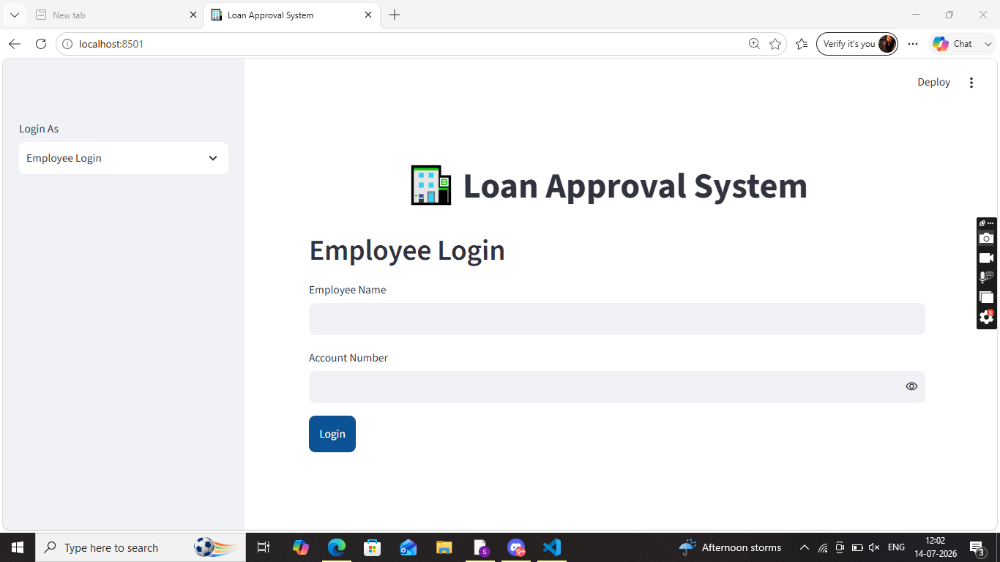
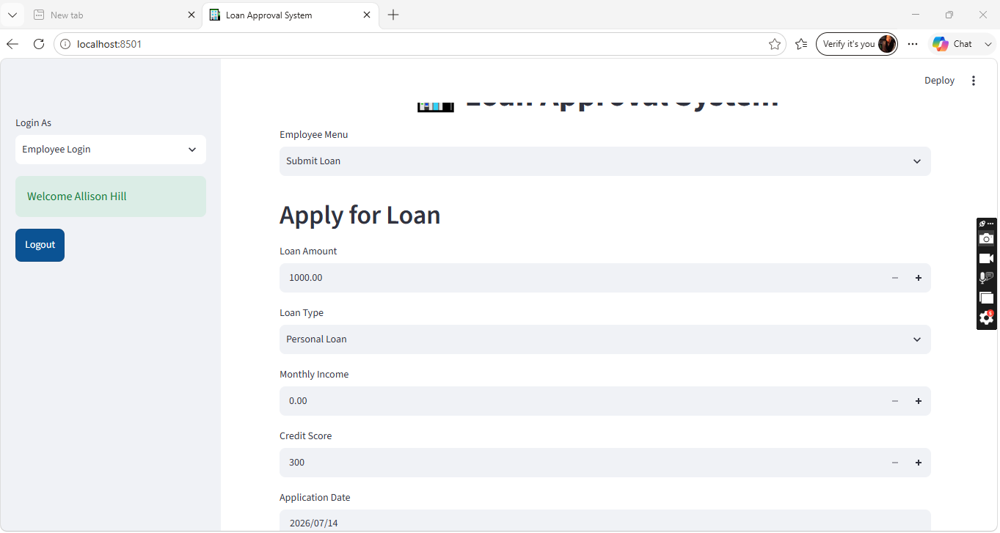
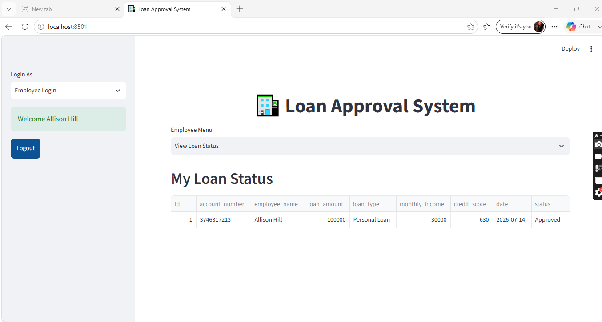
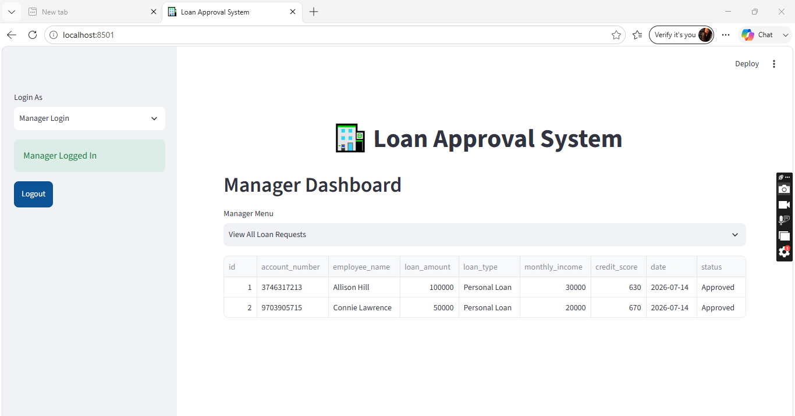
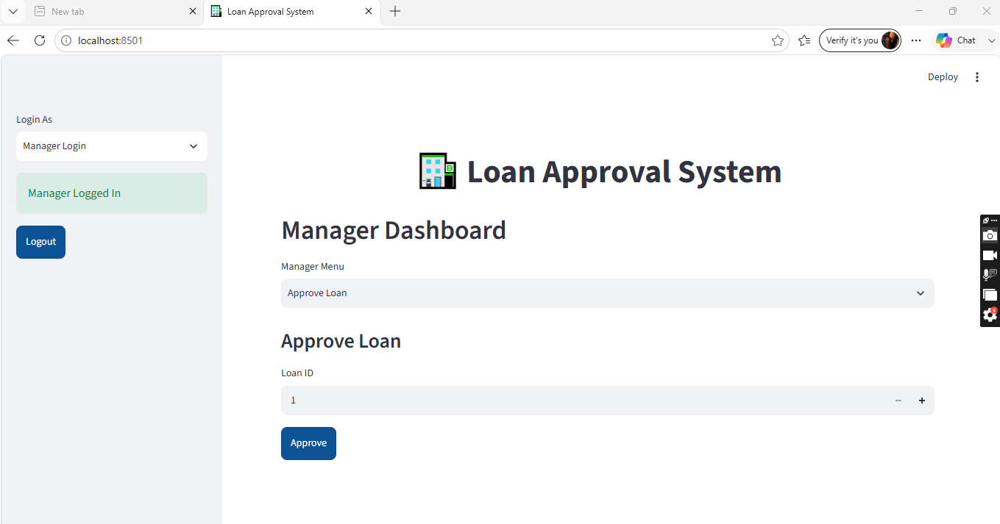
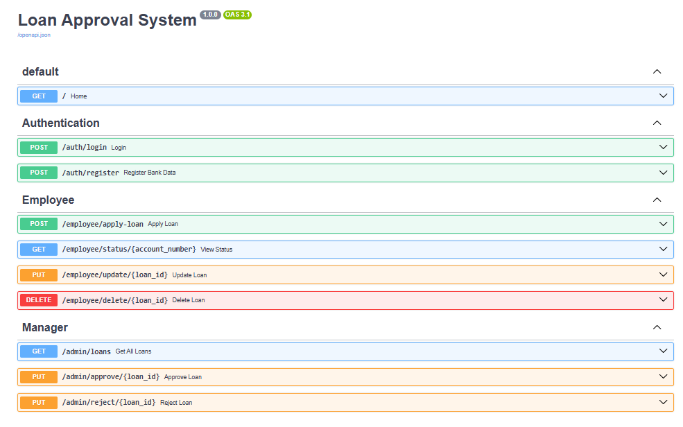
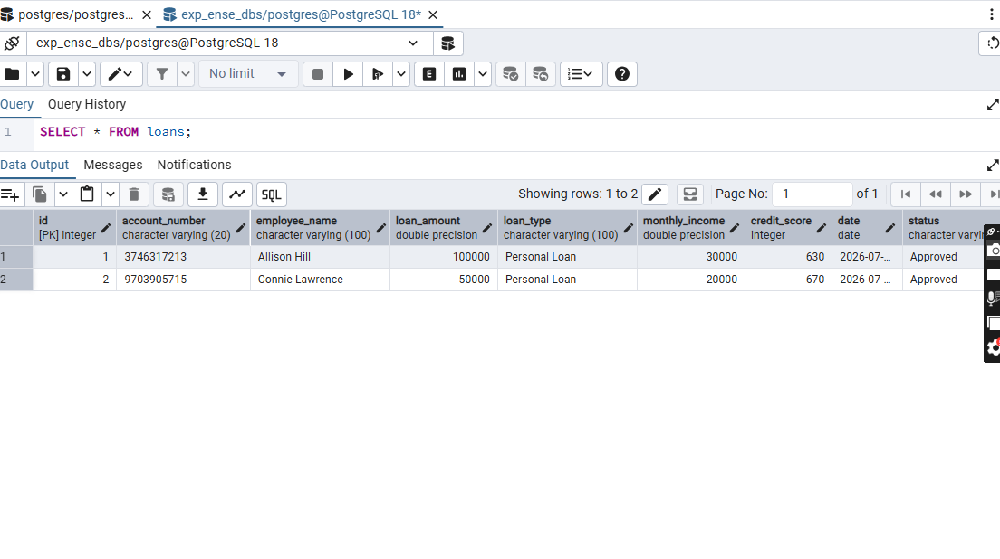
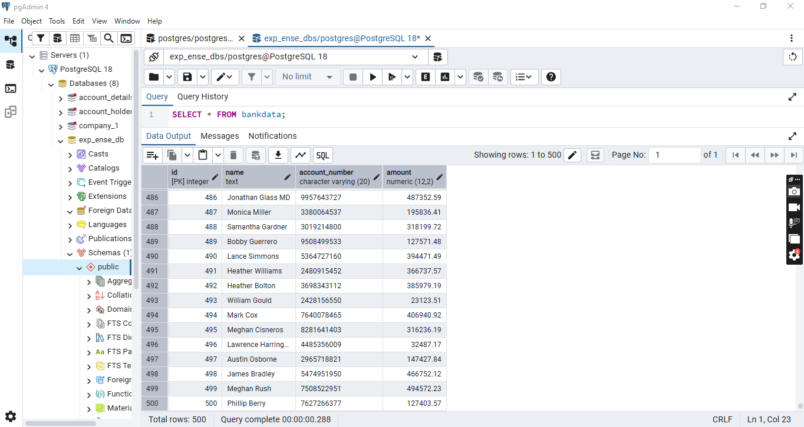

# 🏦 Loan Approval System

A full-stack loan approval and management system built with **FastAPI**, **PostgreSQL**, **SQLAlchemy**, and **Streamlit**. Employees can apply for loans and track their status, while managers can review, approve, or reject applications — all through separate, isolated dashboards.

---

## ✨ Features

- 🔐 **Role-based access** — Separate Employee and Manager panels, fully isolated from one another
- 💰 **Loan application workflow** — Submit, update, delete, and track loan requests
- ✅ **Manager approval flow** — View all pending requests, approve or reject with one click
- 🗄️ **PostgreSQL-backed** — Persistent storage via SQLAlchemy ORM
- 📊 **Bank data import** — Bulk-load account records from JSON into PostgreSQL
- 🎨 **Clean Streamlit UI** — Custom-styled sidebar and dashboard views

---

## 🏗️ Tech Stack

| Layer          | Technology                     |
|----------------|---------------------------------|
| Backend API    | FastAPI                        |
| ORM            | SQLAlchemy                     |
| Database       | PostgreSQL                     |
| Frontend       | Streamlit                      |
| Validation     | Pydantic                       |
| HTTP Client    | Requests                       |

---

## 📁 Project Structure

```
loan-approval-system/
│
├── main.py                # FastAPI application entry point
├── database.py             # SQLAlchemy engine & session setup
├── models.py                # SQLAlchemy ORM models (BankData, Loan)
├── schemas.py                # Pydantic request/response schemas
├── crud.py                    # Database operations (login, apply loan, etc.)
├── import_json.py              # One-time script to import bank_records.json
├── bank_records.json            # Sample bank account data
│
├── routers/
│   ├── auth.py                    # Login & registration endpoints
│   ├── employee.py                 # Employee loan endpoints
│   └── admin.py                     # Manager approval endpoints
│
├── app.py                  # Streamlit frontend (Employee + Manager panels)
└── README.md                 # You are here
```
---

## ⚙️ Setup & Installation

### 1. Clone the repository

```bash
git clone https://github.com/<your-username>/loan-approval-system.git
cd loan-approval-system
```

### 2. Create a virtual environment

```bash
python -m venv venv
venv\Scripts\activate      # Windows
source venv/bin/activate   # macOS/Linux
```

### 3. Install dependencies

```bash
pip install fastapi uvicorn sqlalchemy psycopg2-binary pydantic streamlit requests
```

### 4. Configure PostgreSQL

Create a database and update the connection string in `database.py`:

```python
DATABASE_URL = "postgresql://<user>:<password>@localhost/<your_database>"
```

### 5. Import bank account data (optional)

```bash
python import_json.py
```

### 6. Run the FastAPI backend

```bash
uvicorn main:app --reload
```

API docs available at: `http://127.0.0.1:8000/docs`

### 7. Run the Streamlit frontend

In a separate terminal:

```bash
streamlit run app.py
```

---

## 🔑 Default Manager Credentials

| Field       | Value        |
|-------------|--------------|
| Manager ID  | `admin`      |
| Password    | `Admin@123`  |

> ⚠️ Change these before deploying anywhere beyond local testing.

---

## 📡 API Endpoints

### Authentication
| Method | Endpoint         | Description                  |
|--------|-------------------|-------------------------------|
| POST   | `/auth/login`      | Employee login                |
| POST   | `/auth/register`    | Register a new bank data record |

### Employee
| Method | Endpoint                          | Description                |
|--------|-------------------------------------|------------------------------|
| POST   | `/employee/apply-loan`               | Submit a loan application    |
| GET    | `/employee/status/{account_number}`   | View loan status              |
| PUT    | `/employee/update/{loan_id}`           | Update a pending loan          |
| DELETE | `/employee/delete/{loan_id}`             | Delete a pending loan            |

### Manager
| Method | Endpoint                    | Description               |
|--------|-------------------------------|------------------------------|
| GET    | `/admin/loans`                  | View all loan requests       |
| PUT    | `/admin/approve/{loan_id}`        | Approve a loan                |
| PUT    | `/admin/reject/{loan_id}`           | Reject a loan                  |

---

## 🖥️ How It Works

1. **Employee** logs in using their name and account number (validated against the `bankdata` table).
2. Once logged in, the employee can **submit**, **update**, **delete**, or **check the status** of loan applications.
3. **Manager** logs in separately using fixed admin credentials.
4. The manager can **view all pending loans** and **approve or reject** them.
5. Each panel (Employee / Manager) is fully isolated — selecting one view never shows the other's data, even if both roles are logged in within the same session.

---
# 📸 Project Screenshots

## Loan Approval System - User Interface

<table>
<tr>
<td align="center" width="50%">

### 🔐 Employee Login



</td>

<td align="center" width="50%">

### 📝 Apply Loan



</td>
</tr>

<tr>
<td align="center">

### 📊 Loan Status



</td>

<td align="center">

### 👨‍💼 Manager Dashboard



</td>
</tr>

<tr>
<td align="center">

### ✅ Approve Loan



</td>

<td align="center">

### 🚀 FastAPI Swagger API



</td>
</tr>

<tr>
<td align="center">

### 🗄️ Loan Database



</td>

<td align="center">

### 🏦 Bank Database



</td>
</tr>
</table>

## 📌 Notes

- Account numbers are stored as plain identifiers (not passwords) and matched directly against imported bank records.
- Loan records maintain a foreign key relationship to the `bankdata` table via `account_number`.
- The system is built for local development; add authentication hardening (hashed credentials, JWT, HTTPS) before any production use.

---

## 📄 License

This project is open-source and available for personal or educational use.
